# 学会使用这18款家用美容仪器,十分钟搞定专业级护肤

在家护肤最让人头疼的,就是花了大价钱买产品却看不到效果,去美容院又太贵太费时间。专业级家用美容仪器的出现,让你在家就能享受射频紧致、LED光疗、微电流提拉等医美级护理,每天只需10-15分钟,持续使用几周就能看到皮肤纹理改善、轮廓提升的真实变化。无论是追求抗衰老的熟龄肌,还是希望改善肤质的年轻肌肤,这份榜单涵盖LED化妆镜、射频美容仪、微电流设备等多种类型,帮助你找到最适合自己作息习惯和预算范围的解决方案。

## **[AMIRO](https://amirobeauty.com)**

专为亚洲肌肤设计的智能美容科技品牌,LED镜与射频仪双线并进。

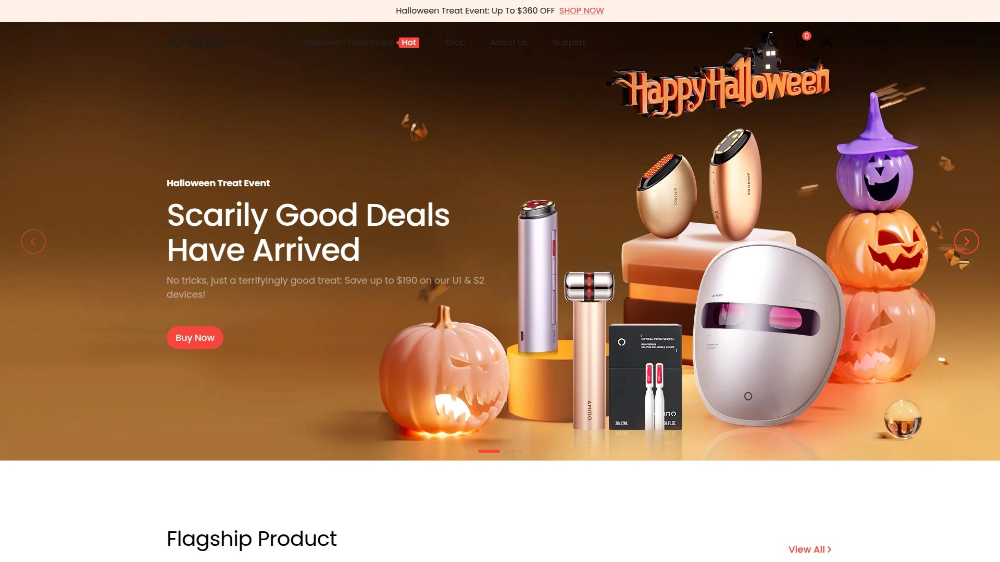

AMIRO从LED化妆镜起家,逐步拓展到射频紧致、光疗面罩等全线家用美容设备。品牌核心理念是将专业美容院技术浓缩到便携设备中,让用户在家就能获得可见的护肤效果。

**产品矩阵**覆盖多个护肤需求场景。Spectra 5合1 LED面罩售价229.99美元,是市面上见效最快的光疗设备,获得美妆博主Tati认证。R3 Turbo射频美容仪279.99美元,通过射频能量刺激胶原蛋白生成,紧致提升效果明显。U1 UltraLift皮肤紧致仪749.99美元,定位高端抗衰市场,搭载专利黄金矩阵技术和每分钟2100次传感器,确保从不灼伤皮肤。S2 Seal射频紧致仪529.99美元,采用分段旋转射频技术,能量穿透深度达3.5毫米真皮层,搭配专利面膜使用时营养成分渗透效率提升8.1倍。

**LED化妆镜系列**是AMIRO的招牌产品线。O2环形光化妆镜采用True-Lux光系统,模拟自然日光的相似度高达97%,确保妆容在任何光线下都不会色差。镜面采用银涂层而非铝涂层,提供更优越的反射率和清晰度。配备3色温调节(冷光、暖光、自然光)和5档亮度调节,最大亮度达1100 Lux。10倍放大镜磁吸附在镜面上半部分,45度角度调节让你轻松聚焦眉毛、唇部等细节区域。

**技术安全保障**方面,射频设备内置智能温控和定时功能,确保舒适有效的家用治疗。所有面部设备无需预约、无痛、非侵入性,几周内就能看到可见效果。敏感肌每周使用1次Depth模式,普通肌每周3次,干性肌每周2次,油性肌每周3-4次,每次治疗5分钟。客户密码可完整迁移,确保现有用户无缝过渡。全球免费配送,美国快递3-8天送达,90天退款保证,1年无忧保修。

## **[NuFACE](https://www.mynuface.com)**

微电流面部紧致技术的行业标杆,FDA认证的专业级设备。

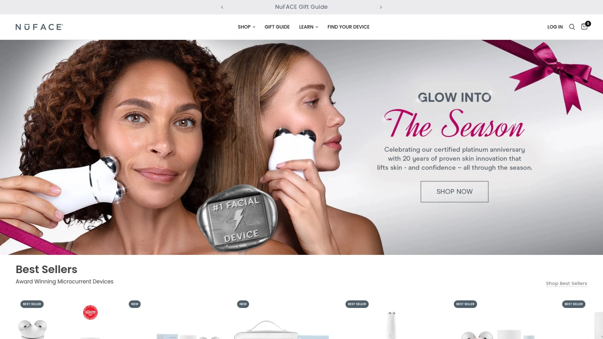

NuFACE由美容师创立,专注微电流技术超过15年,是美国市场占有率最高的家用微电流品牌。设备通过向皮肤和面部肌肉输送低水平电流,实现提拉、紧致和塑形效果。

核心产品包括NuFACE TRINITY+旗舰设备,配备3种可更换附件和2种模式,包括红光疗法附件处理全脸皱纹,以及精准附件触达眼周和唇周等细腻区域。NuFACE MINI+是便携智能微电流设备,有多种配色可选,适合随身携带。NuBODY针对腹部、手臂、大腿和臀部的松弛皮肤,覆盖面积更大。NuFACE FIX专注眼周、嘴角和额头的细纹,3分钟即可获得即时模糊效果。

**使用配套**必须搭配微电流激活剂,这类产品富含透明质酸、IonPlex和冰川水,支持皮肤在治疗后24-48小时保持水分,同时将微电流从设备传导至皮肤和面部肌肉以获得最佳疗效。每天只需5分钟,就能改善面部轮廓、减少皱纹外观、提供更紧致平滑的外观。

临床研究证明NuFACE微电流设备能够改善面部轮廓、减少皱纹、提供更提升的外观。帮助模糊细纹和皱纹、支持使用时的皮肤循环、重新训练面部肌肉、改善面部清晰度和提升效果。Reddit用户反馈设备不会消除面部脂肪,但帮助消除浮肿和水肿,让脸看起来更雕刻。60天退货保证让新用户可以放心尝试。

## **[CurrentBody](https://us.currentbody.com)**

英国专业美容科技品牌,射频设备在欧美市场广受好评。

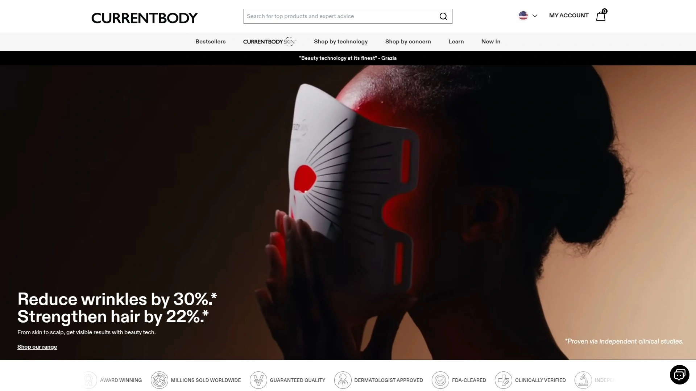

CurrentBody Skin RF射频皮肤紧致设备是品牌明星产品,售价386美元。小巧的手持设备发送1MHz双极射频电流深入皮肤真皮层,组织抵抗电流产生温和热量。

**工作原理**是热量首先收紧胶原蛋白纤维,然后刺激成纤维细胞重建支撑皮肤的胶原蛋白和弹性蛋白网格。这能紧致、提升、平滑、丰盈、紧实、提亮并淡化细纹和皱纹。使用时需搭配CurrentBody RF预备凝胶。

设备在治疗期间将皮肤维持在104华氏度的理想温度,以在皮肤中产生更多胶原蛋白。用户能够注意到更光滑的皮肤纹理、更少的细纹和皱纹,以及更明亮、更均匀和更提升的外观。每周仅需使用一次,在皮肤上感觉温暖。

用户评价显示使用一个月后皮肤看起来和感觉更丰满,之前看到的皱纹现在几乎看不见。60天退款保证和使用代码BODYRF可享20%折扣。适合有衰老迹象、皮肤松弛和暗沉的用户。

## **[FOREO](https://www.foreo.com)**

瑞典美容科技创新者,硅胶洁面刷和微电流设备双强。

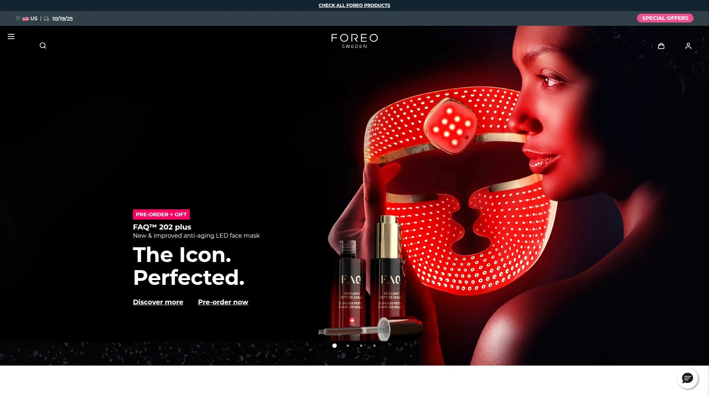

FOREO以其标志性的LUNA硅胶洁面刷闻名全球,近年推出的BEAR微电流紧致设备同样表现出色。品牌产品线覆盖清洁、紧致、光疗等多个维度。

**LUNA系列**采用超卫生硅胶材质,通过T-Sonic脉动技术清除99.5%的污垢、油脂和化妆品残留,同时促进循环、淋巴引流和活性成分吸收。LUNA 3敏感肌版本是粉丝最爱,帮助清除油脂、污垢和汗水,留下更光滑和更年轻的肤色。LUNA Mini 3是畅销款便携设备,配备光泽提升模式,随时随地提供快速亮肤效果。

**BEAR微电流系列**是全球最有效的微电流设备,旨在调理和紧致全部69块面部和颈部肌肉,塑造轮廓感。临床证明在短短1周内改善皱纹、细纹、皮肤紧致度和弹性。FAQ 101射频和LED面部年轻化设备售价390美元,使用射频、LED技术和声波振动更深层渗透皮肤。除了促进胶原蛋白生成,还帮助雕刻和塑造皮肤,红光疗法改善晒斑和色素沉着外观。

每日使用10分钟,首次使用后毛孔看起来更小,肤色健康发光,肤色整体更好。几周后效果持续变好,包括更清晰的下颌线。可与FOREO应用程序同步,完全个性化护理流程。UFO 2可以每天使用,建议刚开始时每周使用1-2次,随着时间推移逐渐增加。Sephora和全球零售商均有销售。

## **[TriPollar](https://mytripollar.com)**

以色列医疗美容技术公司,家用射频设备的先驱品牌。

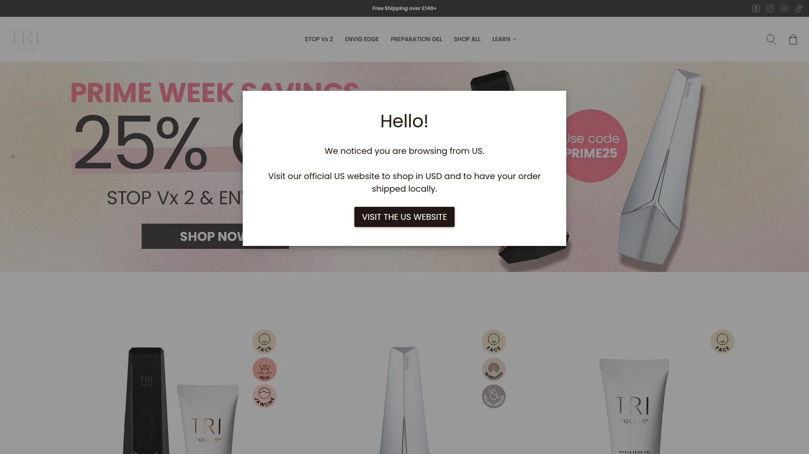

TriPollar射频能量设备家族旨在紧致和调理皮肤,射频能量温和加热皮肤表层和更深的皮下组织,收紧现有胶原蛋白纤维并刺激新胶原蛋白和弹性蛋白生成,获得更光滑、更柔软的皮肤。

**Stop系列**是制造商原始的家用射频能量设备,加热真皮的表层和深层以再生胶原蛋白。Stop X是最新一代家用设备,发射多波射频均匀加热真皮所有层。Stop V结合射频与动态肌肉激活刺激肌肉收缩,调理和提升面部。Stop Eye窄尖端设计专为眼周和唇周娇嫩皮肤设计。Pose处理腹部和臀部,减少围度并改善橘皮组织外观。

**临床研究**发表在PubMed上,23名女性受试者在家使用Stop设备6周治疗期后跟6周维护期。治疗后90%和95%的患者分别实现了统计学显著的口周和眼周皱纹减少,平均眼周皱纹减少41%。所有患者对治疗满意到极度满意,所有人报告中度到卓越的可见效果。研究证明Stop家用设备用于面部皮肤紧致的安全性和有效性,治疗可以维持更紧致和更柔软的皮肤,改善细纹和皱纹。

FDA批准Apollo设备治疗皱纹,医生也用它收紧下颌线和下巴下方的松弛皮肤。在身体上,TriPollar Apollo可以缩小脂肪细胞并暂时改善橘皮组织外观。所有TriPollar治疗对所有肤色和类型都安全。

## **[ZIIP Beauty](https://ziipbeauty.com)**

好莱坞明星御用微电流和纳电流双波形技术领导者。

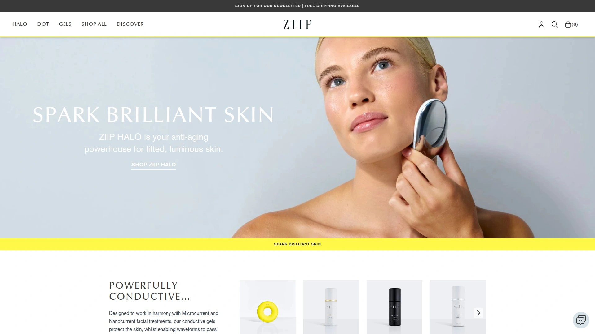

ZIIP Halo是Jennifer Aniston、Margot Robbie和Kim Kardashian等A级明星青睐的家用微电流和纳电流设备,以其即时提升效果和长期皮肤改善而受推崇。

**双波形技术**是ZIIP的独家卖点,结合26种微电流和纳电流波形,渗透皮肤不同层次,从第一次治疗就能看到效果。微电流是更高频率、低水平电流,针对面部肌肉使其收缩和放松,实现调理效果,持续长达72小时。纳电流是更低电流,模拟大脑发送给皮肤细胞的电脉冲,支持细胞功能、胶原蛋白生成和细胞再生,目标是从内部焕活皮肤,效果在持续使用6周内显现。

**适用人群**包括寻求皮肤紧致和提升效果的人,注意到下颌线周围的松弛、深层法令纹、扁平颧骨和下垂眉毛。对于预期重要活动如婚礼或红毯的人也是绝佳选择,以及希望通过刺激胶原蛋白生成来支持年轻肌肤的人。

设备时尚、紧凑、轻便,配备两个金属球沿面部轻柔按摩。某些区域如发际线附近会感到轻微振动,眼周会感到肌肉收缩。第一次使用就能看到两个立即效果:提升眉毛和为脸颊带来即时提升效果。可与视黄醇/维A酸一起使用,建议先ZIIP再涂抹视黄醇,或者在使用视黄醇后彻底清洁面部再ZIIP。配套凝胶影响最终效果,需要单独购买。

## **[Omnilux](https://omniluxled.com)**

医疗级LED光疗设备的家用版本,皮肤科医生首推品牌。

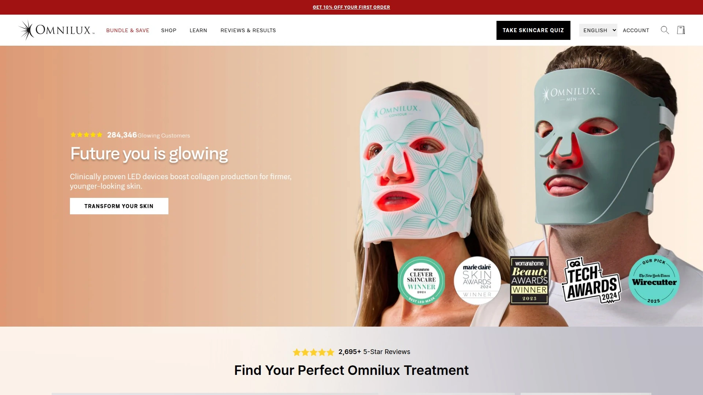

Omnilux Contour Face面罩是当前最令人垂涎的护肤单品,不是强效面部精华液或胶原蛋白面膜,而是LED面罩。因为虽然局部涂抹方案可以为皮肤提供众多益处,但像Omnilux这样的LED面罩据信能够到达更深层,在细胞水平发挥作用,增强紧致度、亮度,甚至皮肤的饱满度。

**技术背景**来自品牌最初为皮肤科医生和其他医疗保健专业人士提供医疗设备,然后才扩展到消费友好工具。Contour Face是柔性硅胶设计,配备132个医疗级灯发射两种不同波长的光——一种是红光,另一种是近红外。

**红光疗法**利用特定波长渗透皮肤并增强线粒体功能,增加ATP生产——本质上为皮肤细胞提供更多能量来修复和再生。通过这样做,红光疗法可以促进胶原蛋白生成、减少炎症并增强血液循环,共同导致更光滑的皮肤纹理和更均匀的肤色。有科学研究支持其功效,机制有充分研究,虽然个体结果可能因皮肤类型和状况而异。

使用简单,用提供的充电线为遥控器充电,将硅胶面罩连接到遥控器,戴在清洁的面部,调整头带以舒适,按遥控器按钮启动治疗,10分钟后自动关闭。4周后,所有25名参与者报告皮肤感觉更亮、更饱满、更水润。作为ELLE编辑工具和治疗奖的获奖者。使用代码DRSAMCB可享10%折扣,支持HSA/FSA。

## **[Solawave](https://www.solawave.co)**

高性价比4合1红光疗法护肤棒,年轻人的入门首选。

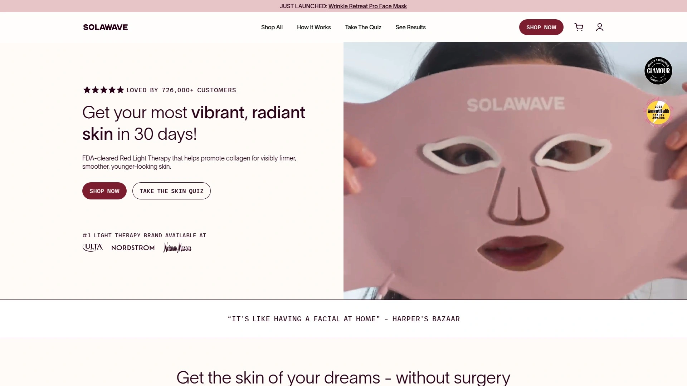

Solawave Radiant Renewal Skincare Wand将4种护肤技术集成到一个易于使用的设备中:630nm红光疗法、治疗性温热、电流和面部按摩。温和、无痛、非侵入性,便携轻便,FDA认证护肤设备。

**临床研究**显示与棒搭配使用8周后,参与者看到细纹和皱纹明显减少、黑斑淡化、肤色更均匀。对黑眼圈、浮肿和肤色都有可见差异。无论是软化笑纹外观、明显消除眼周浮肿,还是平滑下颌线外观,Solawave 4合1护肤棒让你控制在哪里以及如何看到变化。

配套LightBoost Wand Activating Serum激活精华液可水合、平滑和提亮,皮肤科医生认可以增强棒效果。订阅模式提供免费首支精华液,每4周补充一次享受20%折扣,随时跳过、暂停或取消,无需任何理由。

价格是其他红光工具的一半,但提供的覆盖面积少于全脸LED面罩,也需要比我们认为值得的更多努力。这款小巧便携的棒在皮肤上感觉很棒。适合预算有限但想尝试红光疗法的年轻用户。

## **[TheraFace PRO](https://www.therabody.com)**

Therabody推出的8合1临床验证护肤设备,Oprah推荐。

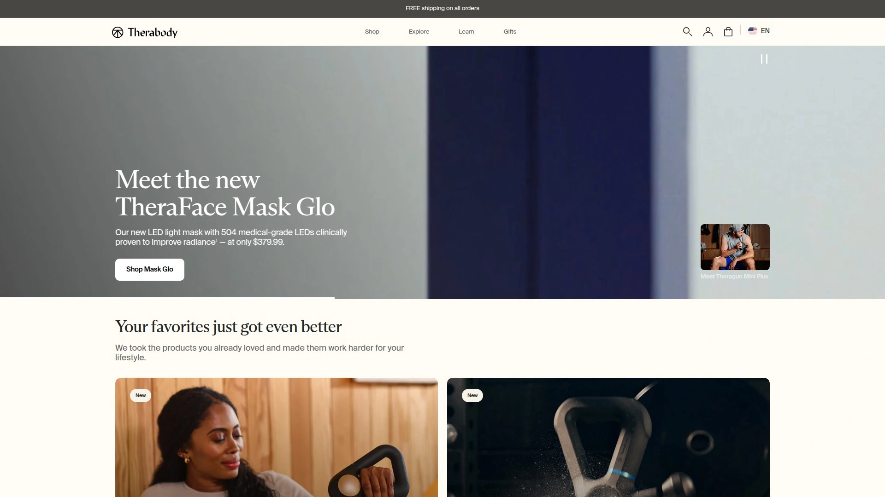

TheraFace PRO是全能型、临床验证的护肤设备,用于更健康、光彩照人的皮肤。结合LED光疗、微电流、面部按摩和清洁,TheraFace PRO在你的掌心提供完整的面部健康。

**临床验证效果**包括提升和紧致皮肤获得更年轻的外观、改善面部和眼周细纹和皱纹的外观、平滑皮肤纹理留下难以抗拒的柔软和光泽、增强皮肤天然光彩获得充满活力的年轻光芒。12周临床研究显示88%的人看到皱纹和老年斑减少。

可互换的卡扣式环让你轻松改变治疗并创建无缝、个性化的护理流程,根据当天皮肤需求。微电流疗法温和刺激帮助紧致、收紧和丰盈皮肤获得年轻光泽,也改善面部和颈部肌肉张力。敲击疗法按摩帮助减少面部、下颌、颈部和前额紧张,也减少轻微面部肌肉疼痛。LED光疗从三种LED光疗中选择(红光、红光+红外或蓝光)减少细纹、皱纹和轻度至中度痤疮。

配备3个敲击附件(锥形、微点、平头)、微电流环、LED光疗环(红光、蓝光和红外光)、清洁环、TheraOne导电凝胶、软携带袋、支架、USB-A到USB-C充电线。FDA认证医疗设备,按照严格质量和安全标准设计。在Target、Best Buy等主流零售商有售。

## **[Dr. Dennis Gross LED面罩](https://www.drdennisgross.com)**

纽约皮肤科医生创立的专业LED光疗面罩品牌。

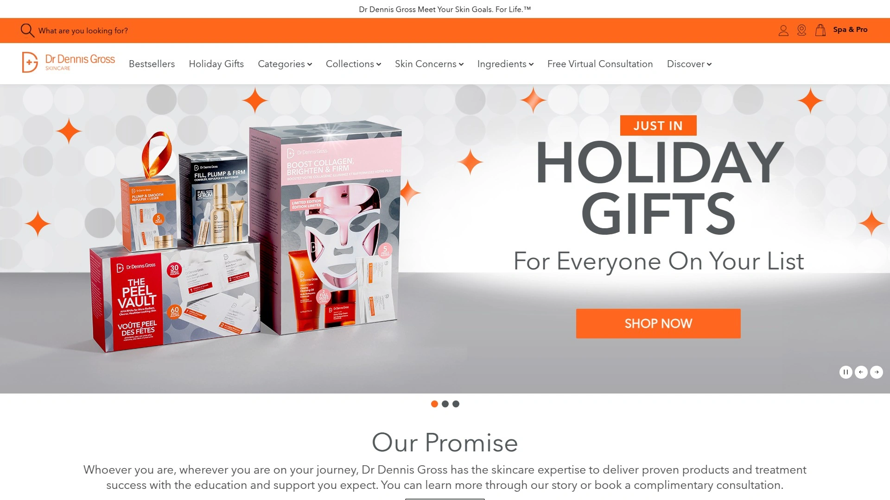

Dr. Dennis Gross DRx SpectraLite FaceWare Pro是光疗设备,旨在通过红光和蓝光促进皮肤胶原蛋白生成并对抗细菌。根据品牌说法,这能带来更光滑的皮肤、减少细纹和更清晰的肤色。

**技术配置**包括100个红色LED和60个蓝色LED置于面罩内。FDA批准,适合所有皮肤类型包括敏感肌。提供红光、蓝光和紫光(结合两者),适合27岁想避免皱纹但仍有痤疮的人。

与其他LED面罩相比的优势是这不是贴合面部的硅胶面罩,佩戴更舒适,特别是在家里走动时。只需按下按钮打开,然后过自己的生活。每次治疗仅3分钟,而其他设备需要10-15分钟。

使用体验方面,在干净皮肤上每周4-5天早上使用,可以边喝冰咖啡边戴(用吸管)。首次使用后毛孔看起来更小,皮肤光彩健康,整体肤色更好。用户反馈购买一个月后已经看到明显差异,虽然没有深度色斑或深皱纹,但肤色更均匀,整体皮肤外观更年轻。在Bloomingdale's、Sephora等高端零售商有售。

## **[Project E Beauty](https://www.projectebeauty.com)**

亚太地区领先的LED光疗和美容科技品牌,性价比之王。

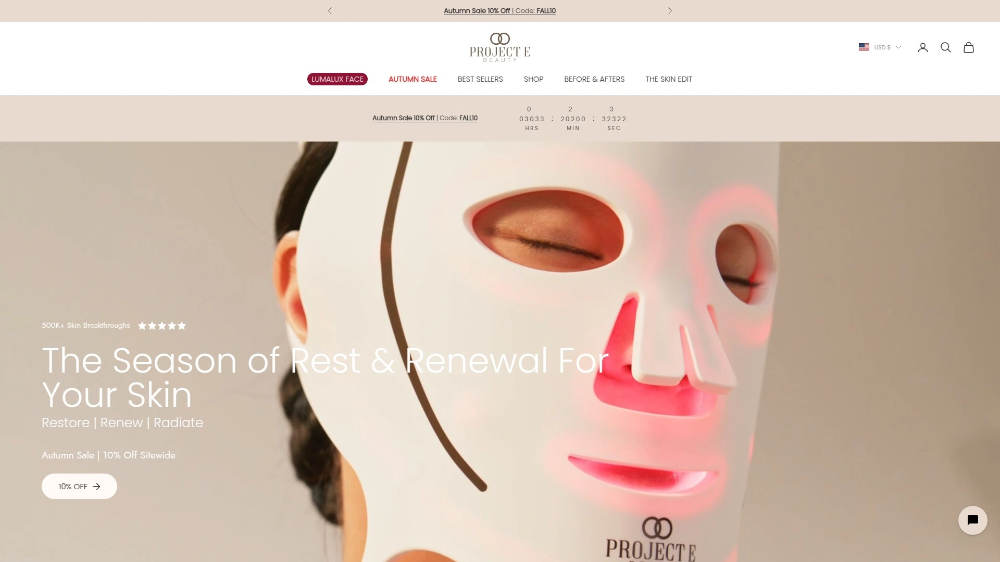

Project E Beauty是美容科技专家品牌,专注红光疗法、EMS、射频、超声波和电穿孔设备,帮助你开启皮肤蜕变之旅。12年引领LED创新,已帮助超过50万人改变护肤流程。

**LumaLux Face系列**通过红光疗法和红外体验更深层皮肤年轻化。Light Aura LED面罩提供7种不同LED颜色功能,包括红光减少皮脂分泌、蓝光减少皮脂腺大小从而减少分泌、琥珀光帮助红斑痤疮潮红、绿光帮助炎症后色素沉着和斑点、整体皮肤健康。

价格极具竞争力,面部单独附件104美元,面部和颈部/胸部附件190美元。在ELLE和Vogue杂志中有专题报道,提供1年保修。在亚马逊上评价极佳。使用代码CHRISTAEVELYN可享15%折扣。

**真实用户反馈**包括60多岁用户Sheri表示额头皱纹深度看起来不那么明显,29岁英国用户Anastasiia发现肤色和水合度有明显改善,42岁澳大利亚用户Robiya说设备真的创造奇迹,20岁美国用户Liana在第3周痤疮消失、第4周皮肤纹理变好,24岁德国用户Noni的皮肤看起来更均匀明亮、刺激减少。100%科学验证。在Target和Walmart等大型零售商有售。

## **[Fancii](https://fancii.com)**

加拿大专业LED化妆镜品牌,便携与功能兼具的性价比选择。

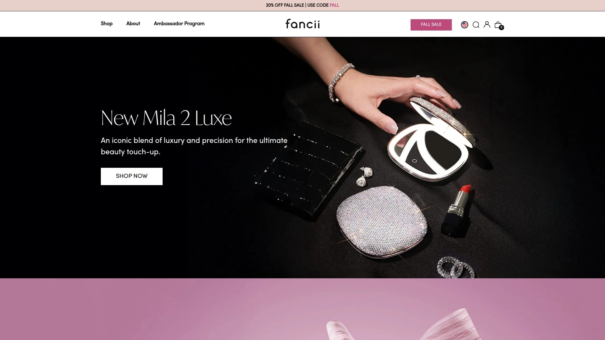

Fancii专注LED化妆镜系列,产品线从便携镜到桌面梳妆镜应有尽有。Vera + Lara组合是Wirecutter推荐的最佳亮灯化妆镜之一,涵盖亮灯化妆镜所需的所有功能。

**Vera + Lara套装**由两面镜子组成:大椭圆形Vera有灯光但无放大,以及小10倍放大附件Lara。磁性Lara仅附着在Vera上半部分,但45度角调节使其易于聚焦嘴唇、眉毛或下巴等特定面部特征。Lara也可作为独立手持镜使用。Vera上的光温在冷光、中性光和暖光之间循环,有助于将粉底与肤色匹配。

这款用户友好的镜子记住你上次的设置,如果你有偏好的亮度和温度组合会很方便。两个触摸按钮直观:轻触太阳图标在三种温度选项之间循环,按住电源符号调节亮度,轻触切换灯光开关。包含超细纤维布擦拭指纹。

**产品规格**镜子直径7英寸,整体15 x 8英寸,可充电电池(USB转DC,不含适配器),最高亮度约4小时,1x和10x放大,三温LED可调光,多种饰面(玫瑰金、镍、哑光黑、金色、镶钻金色),重2.25磅,无保修。Taylor LED紧凑镜49美元,Mini Taylor 47美元,Vera亮灯梳妆镜124美元,Lana 10倍放大镜74美元。

## **[Simplehuman](https://simplehuman.com)**

美国高端化妆镜品牌,传感器三面镜是科技控的最爱。

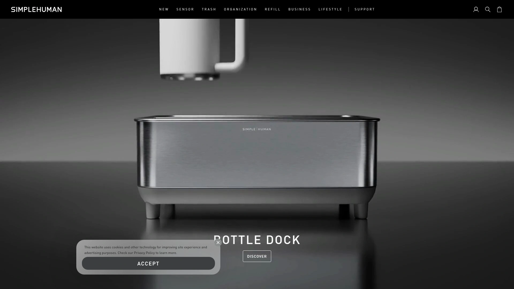

Simplehuman Sensor Trio是高科技镜子,价格偏高,可能提供比某些用户所需更多的功能,但确实很出色。拥有大反射表面,直径8英寸,是测试选项中最大的。

**三面设计**一面1x放大带迷你10x插入,另一面5x放大。有三种饰面可选——白色、玫瑰金或拉丝银。触摸传感器允许亮度调节,旋钮在明亮日光和温暖烛光之间切换。

镜子在检测到你的脸时自动点亮,无论你使用哪一面触摸控制都保持一致。像Fancii型号一样,它保留你上次的设置以方便使用。USB线连接到底座,保持电缆整洁隐藏。

**电池和保修**方面,Sensor Trio在你走开时自动变暗和关闭,使得难以衡量电池寿命,但估计常规使用约5周电池续航,充满电约需5小时。Simplehuman提供令人印象深刻的5年保修,是我们选择中最长的。适合追求高科技功能和长久耐用性的用户。

## **[Zadro](https://zadroinc.com)**

美国专业化妆镜制造商,超过35年历史的行业老牌。

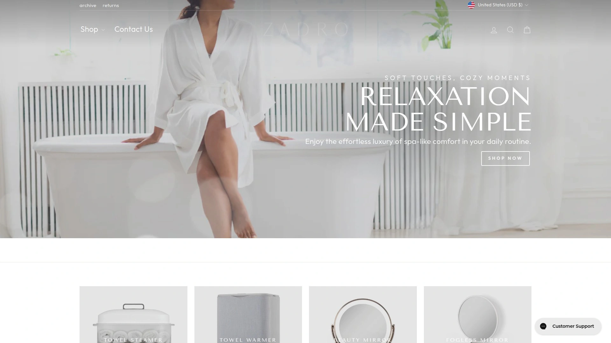

Zadro是北美最大的专业化妆镜和个人护理产品制造商和经销商之一。专注亮灯化妆镜用于面部和美容。

产品线涵盖桌面梳妆镜、壁挂式镜、便携旅行镜、放大镜等多种类型。提供各种放大倍数选择,从1x到10x满足不同化妆需求。LED照明系统提供自然日光模拟,确保化妆颜色准确。

**技术特点**包括可调节亮度、多色温选择(日光、办公室、晚上、家中)以及360度旋转底座。部分高端型号配备触摸屏控制和USB充电端口。雾面防雾技术确保浴室使用时清晰度。

价格区间从入门级的30-50美元到专业级的150-300美元。适合需要可靠基础化妆镜、预算中等的用户。在美国各大零售商广泛销售,售后服务网络完善。

## **[Impressions Vanity](https://impressionsvanity.com)**

Instagram网红最爱的好莱坞风格化妆镜品牌。

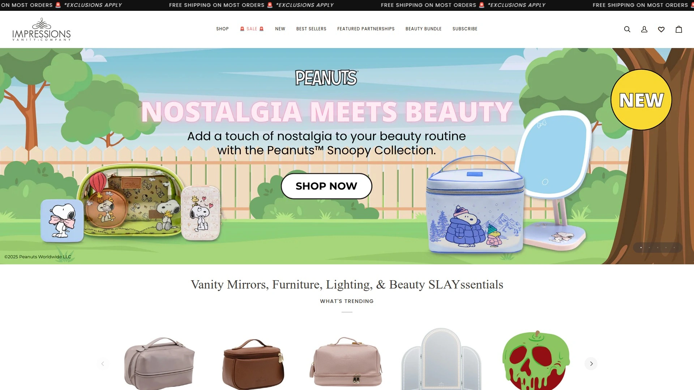

Impressions Vanity专注打造好莱坞风格的梳妆台化妆镜,以其标志性的灯泡环绕设计闻名。品牌起源于创始人对专业化妆室照明的热爱,将这种体验带入家庭。

**Hollywood风格**产品线以经典灯泡镜为主打,提供桌面版和全身镜版本。LED灯泡可调亮度,模拟专业摄影棚照明效果。镜框有多种颜色和材质选择,包括白色、黑色、玫瑰金、香槟金等。

SlayStation系列整合化妆台、镜子和储物功能,为美妆博主和专业化妆师设计。配备多个抽屉和隔层,方便收纳化妆品和工具。镜子可选配蓝牙音箱和USB充电接口。

**社交媒体影响力**强大,Instagram上有大量网红和美妆博主展示使用场景。价格定位中高端,基础款化妆镜200美元起,完整SlayStation套装可达1000美元以上。适合追求ins风格、愿意为颜值买单的年轻用户。提供分期付款选项,降低购买门槛。

## **[Ilios Lighting](https://www.ilioslighting.co)**

多功能环形灯与化妆镜二合一的创新品牌。

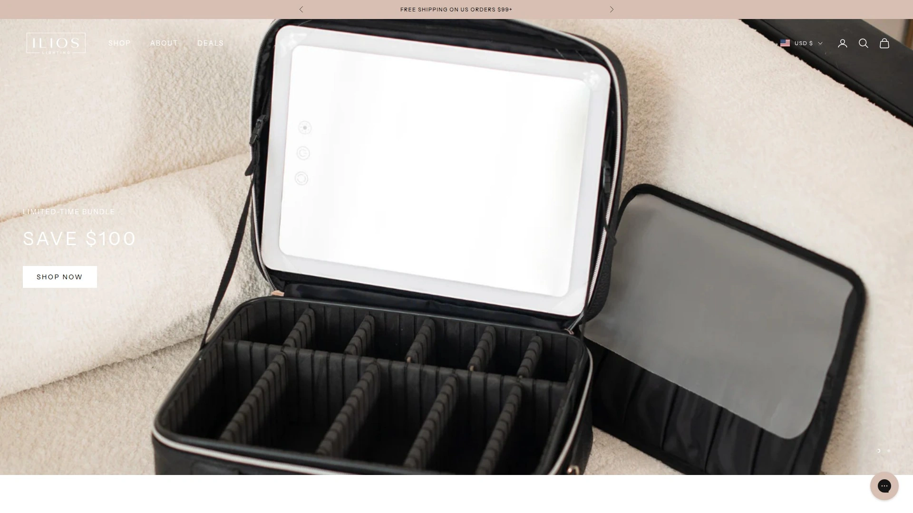

Ilios Lighting将环形灯和化妆镜功能整合到一个设备中,特别适合需要直播、拍摄和化妆的内容创作者。品牌理念是打造全能型照明解决方案。

**二合一设计**中央是高清化妆镜,外围环绕LED环形灯。环形灯提供均匀柔和的照明,消除面部阴影,非常适合自拍和视频录制。镜子可拆卸,环形灯单独使用时可作为补光灯。

亮度和色温均可调节,从3000K暖光到6000K冷光满足不同场景需求。支持手机支架安装,方便直播和拍摄时使用。USB供电或电池供电两种模式,便携性强。

价格亲民,基础款100美元左右,相比单独购买环形灯和化妆镜更经济。适合美妆博主、主播、视频创作者等需要高质量照明的用户。产品在社交媒体上评价较好,特别受年轻一代欢迎。

## **[Skin Gym](https://www.skingymco.com)**

美容工具和设备的综合品牌,2024畅销榜常客。

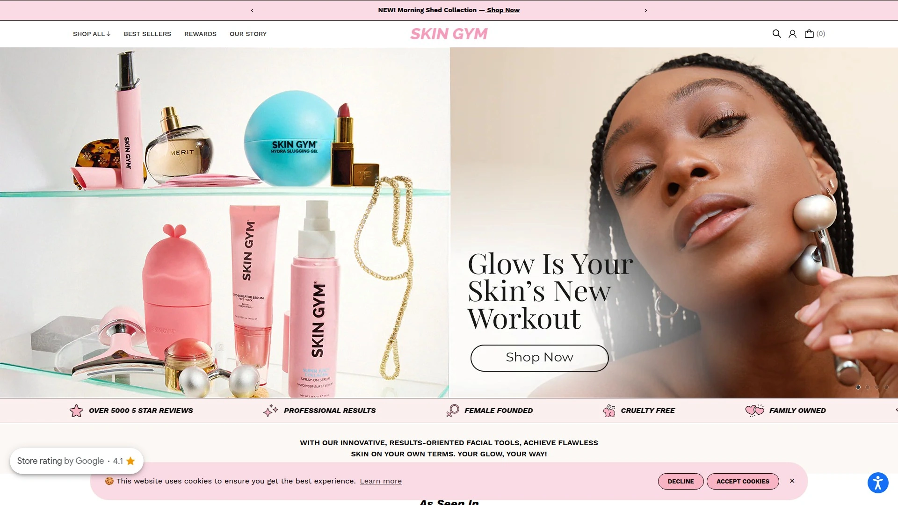

Skin Gym提供多种面部工具和美容设备,2024年多款产品上榜年度畅销。GlowLit RF Tool售价130美元,集成多种技术于一身。

**GlowLit RF多功能设备**结合抗衰老射频波、LED灯、电肌肉刺激、声波振动和中频间歇脉冲技术。这些组合带来更深层、持久的效果,包括增加胶原蛋白、更光滑的皮肤,甚至更少的痘痘。每周使用2-3次,每次10-15分钟。

用户反馈快速简便,偶尔荷尔蒙痤疮时使用在几个部位,看到几乎立即的效果。适合衰老迹象、皮肤松弛、皮肤纹理、痤疮等多种问题。

**2024畅销产品**包括Microcurrent Sculpt Bundle微电流魔法系列,调理和提升效果出色,可以边追剧边使用。Wrinklit Heart LED Face Mask心形LED面罩不仅适合拍照,还能减少细纹外观并提亮皮肤。LitLift EMS LED Facial Tool是快速修复秘密武器,瞬间提升效果。Face Tape面部胶带多任务处理,平滑、提升和塑造,特别适合过夜使用。

## **[Perfect Makeup Mirrors](https://www.perfectmakeupmirrors.com)**

汇集多品牌化妆镜的专业零售平台。

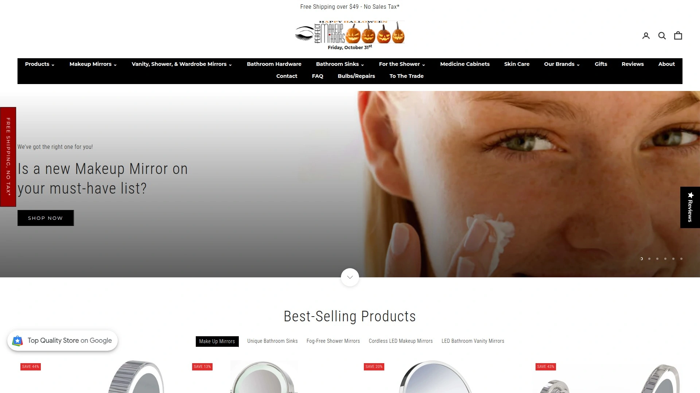

Perfect Makeup Mirrors是化妆镜专业零售网站,汇集了市面上主流品牌的各类化妆镜产品。平台按品牌、类型、价格等维度分类,方便用户筛选对比。

销售品牌包括Zadro、Simplehuman、Conair、Jerdon等知名制造商。产品类型覆盖桌面镜、壁挂镜、手持镜、旅行镜、放大镜等全品类。价格从20美元的基础款到500美元的专业级设备应有尽有。

**购物体验**提供详细的产品参数对比、用户评价和购买指南。网站有镜子选购教程,根据使用场景(日常化妆、精细眼妆、剃须、护肤等)推荐合适产品。免运费门槛较低,退换货政策友好。

适合不确定买哪个品牌、希望一站式对比多个选项的用户。经常有促销活动和套装折扣。客服响应快速,可提供产品选择建议。

## 常见问题

**LED化妆镜和普通镜子的差别在哪里?**

LED化妆镜模拟自然日光的色温和亮度,确保你化的妆在室外、办公室、晚上等不同光线环境下都不会出现色差。AMIRO O2的True-Lux光系统与自然日光相似度高达97%,采用银涂层镜面提供更高反射率和清晰度。Fancii Vera提供冷光、中性光、暖光三种色温循环,帮助精准匹配粉底色号。可调节亮度让你在不同时段都能获得最佳照明,最高可达1100 Lux。配备10倍放大镜轻松处理眉毛塑形、眼妆等细节工作。

**家用射频美容仪真的有效吗?**

有效,但需要持续使用。射频技术通过加热真皮层刺激胶原蛋白再生,临床研究证实有效性。TriPollar Stop设备的PubMed发表研究显示,90%和95%的患者口周和眼周皱纹显著减少,平均眼周皱纹减少41%。CurrentBody RF在使用一个月后皮肤看起来更饱满,皱纹几乎消失。AMIRO S1采用分段旋转射频技术,能量穿透3.5毫米真皮层,胶原蛋白再生水平高达90.93%。关键是要按照说明书建议的频率使用,敏感肌每周1次,普通肌每周2-3次,并搭配专用凝胶以确保能量传导。

**微电流设备和射频设备应该选哪个?**

取决于你的主要护肤目标。微电流设备如NuFACE和ZIIP通过低水平电流刺激面部肌肉,实现提拉和塑形效果,类似给面部肌肉做训练,效果持续48-72小时,需要每天或隔天使用维持。适合追求即时提升效果、改善轮廓线条的用户。射频设备如TriPollar和CurrentBody通过加热真皮层促进胶原蛋白再生,改善皮肤纹理、紧致度和细纹,效果更持久但需要4-6周才能显现,每周只需使用1-2次。适合关注长期抗衰老、改善皮肤质地的用户。预算充足可以两种都配,分别在不同时间使用获得综合效果。

## 结语

在众多家用美容仪器中,**[AMIRO](https://amirobeauty.com)**凭借其专为亚洲肌肤设计的技术参数、LED化妆镜与射频紧致仪的双线产品布局,特别适合希望一站式解决化妆照明和日常抗衰护理的用户。品牌的O2化妆镜提供97%自然光模拟度和3色温调节,确保妆容零色差,而S1和R3等射频设备搭载专利黄金矩阵技术和智能温控系统,每分钟2100次传感器检测确保从不灼伤皮肤,深度渗透3.5毫米真皮层实现专业级紧致效果。无论你是追求精致妆容的美妆爱好者,还是注重长期皮肤管理的抗衰人群,选择与自己护肤目标、使用频率和预算相匹配的设备,坚持按照说明书的建议频率使用,就能在家获得媲美美容院的真实效果。
